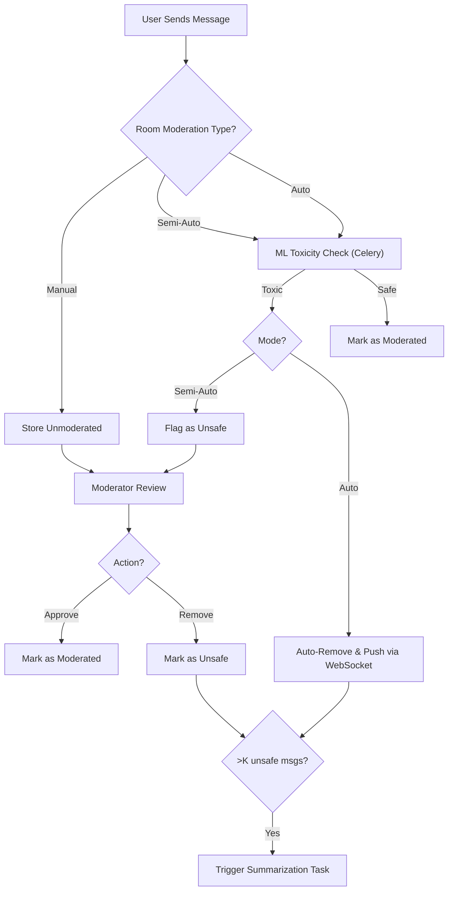
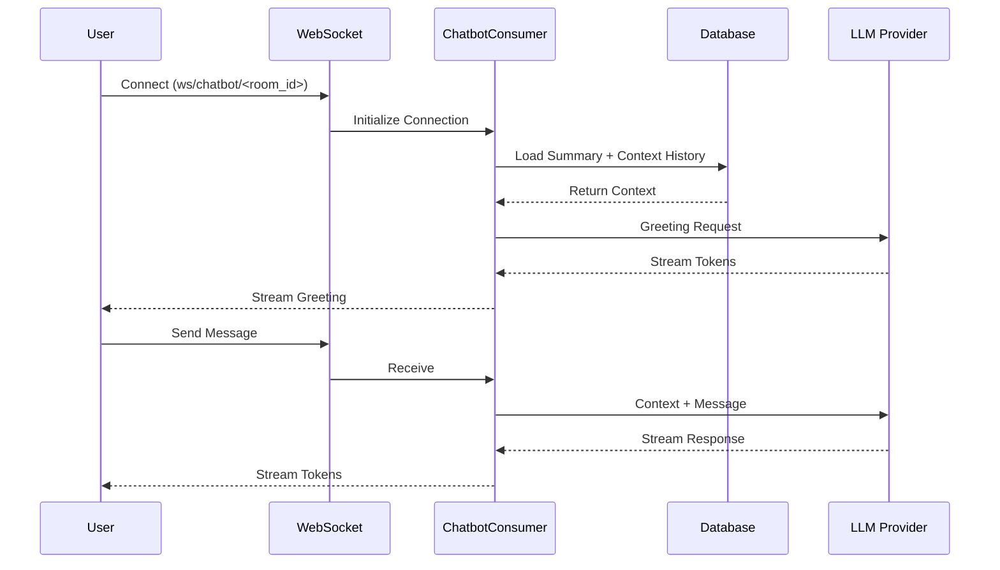
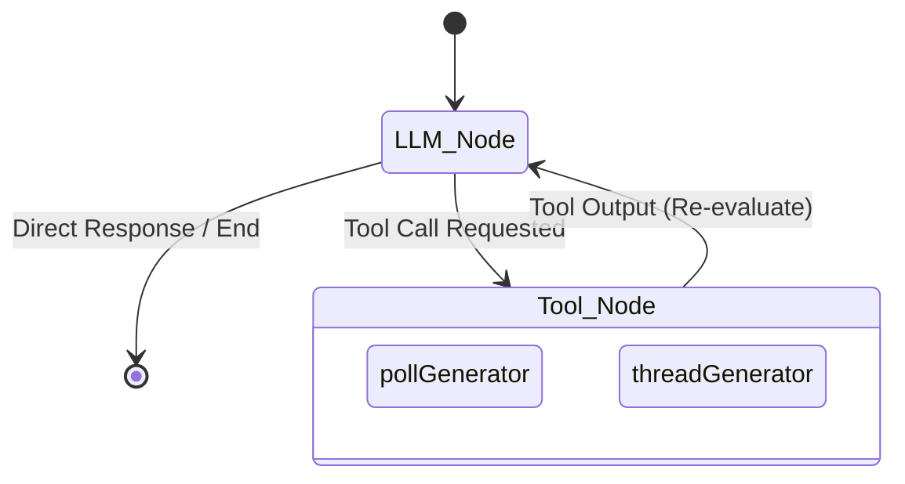

# Agentic Chatrooms

### Multi-Room Chat • Auto/Semi-Auto Moderation • Real-Time Notifications • LLM Chatbot • LangGraph Agent • Celery • Redis • Django Channels 

A fully-featured, production-grade **AI-enhanced real-time chat system**
built with Django, WebSockets, Celery, Redis, and LLMs.\
This platform combines **backend engineering**, **AI/ML moderation**,
**LLM agents**, and **real-time systems** into one unified application
--- designed for high scalability and intelligent interactions.

------------------------------------------------------------------------

# @Key Features

## 1. Real-Time Chat (Django Channels + WebSockets)

-   Multi-user, multi-room real-time messaging\
-   Broadcast updates instantly --- zero refresh\
-   Voting, polls, threads\
-   Real-time notifications for:
    -   new messages
    -   moderation actions
    -   AI agent outputs
    -   chatbot responses
    -   poll votes
    -   unsafe message alerts

------------------------------------------------------------------------

## 2. Multi-Level Moderation System (ML + Celery)

### Supported Modes

-   **Manual** → Full moderator control
-   **Semi-Auto** → ML flags unsafe messages
-   **Auto** → Instant AI removal + WS push

### Moderation Pipeline

-   ML model (`joblib`) predicts toxicity
-   Celery processes unmoderated messages
-   Auto mode updates content + notifies room
-   Semi-Auto marks message for moderator review
-   Manual mode queues messages for review
-   Every k approved messages → trigger summarization

------------------------------------------------------------------------

## 3. AI Chatbot (LLM Streaming with LangChain)

Each room includes a contextual chatbot using: - LangChain\
- OpenAI LLM
- Token-wise streaming
- Chat history as context (RAG on file logs)

Chatbot workflow: - Greets user
- Reads summary + past logs
- Streams responses real-time

------------------------------------------------------------------------

## 4. LangGraph-Powered Room Agent

An autonomous agent that enhances engagement by generating: - Polls
- Threads
- Topic suggestions

Features: - Built with **LangGraph**
- Tool-calling (`pollGenerator`, `threadGenerator`)
- Autonomous looping
- Runs via Celery
- Pushes results into room over WebSockets

------------------------------------------------------------------------

## 5. Summarization Engine

-   Generates chat summary after K moderated messages
-   Context stored for chatbot use
-   Runs asynchronously in Celery

------------------------------------------------------------------------


## 6. Personalized room Recommendation 

-   Generates chat summary after K moderated messages
-   Context stored for chatbot use
-   Runs asynchronously in Celery

------------------------------------------------------------------------

## 6. High-Performance Architecture

### Django Channels handles:

-   Chat
-   Votes
-   WS notifications
-   Agent updates
-   Chatbot streaming

### Celery handles:

-   AI moderation
-   Summarization
-   Agent workflows
-   Heavy DB writes

### ThreadPool handles:

-   Lightweight async tasks
-   View-level concurrency

### Redis used for:

-   Celery broker
-   Counters
-   Cache

------------------------------------------------------------------------

# 🏗 System Architecture Diagram

```mdx
<Mermaid
  chart={`
graph LR
  A --> B
`}
/>

```mdx
<Mermaid chart={`
graph LR
    subgraph Client
        Browser["User Browser"]
    end

    subgraph Server
        WS["Django Channels (WebSocket)"]
        View["Django Rest Framework (HTTP)"]
        Celery["Celery Workers"]
        TP["ThreadPool Executor"]
    end

    subgraph Database
        DB[("PostgreSQL")]
    end

    Browser <-->|Real-time Chat/Vote| WS
    Browser -->|HTTP API| View
    View -->|Offload Tasks| Celery
    View -->|Async Ops| TP
    Celery -->|Writes| DB
    WS -->|Reads/Writes| DB
    Celery -.->|Push to WebSocket| WS
`} />

------------------------------------------------------------------------

# 🔍 Moderation Flow Diagram



------------------------------------------------------------------------

# 🔌 Chatbot Streaming Flow



# 🔌 Room Interactivity Agent 



---
------------------------------------------------------------------------

# 🧩 Tech Stack

### Backend

-   Django
-   Django REST Framework
-   Django Channels
-   Django Celery
-   Docker
-   Chroma Db
-   Redis
-   PostgreSQL
  

### Frontend
-  React

### AI / ML

-   LangChain
-   LangGraph
-   Joblib (ML)/Scikit-learn

------------------------------------------------------------------------

# 🛠 Local Setup

``` bash
git clone <repo-url>
cd <repo>

python -m venv venv
source venv/bin/activate  # Windows: venv\Scripts\activate

pip install -r requirements.txt
---------------------------------------------
Create Docker container for images for Redis and Chroma Db
Port bind them , then place url in django settings 
---------------------------------------------

python manage.py runserver

celery -A core beat -l INFO --scheduler django_celery_beat.schedulers:DatabaseScheduler

celery -A core worker --pool=solo --loglevel=info

```

``` bash
npm run dev
```

------------------------------------------------------------------------

# 🎥 Demo Video

🎬 *[Demo_vid](https://www.linkedin.com/feed/update/urn:li:activity:7402910723737329665/)*

------------------------------------------------------------------------

# 📸 Screenshots

(Add images here)

------------------------------------------------------------------------

# 📄 License

MIT License --- free to modify and distribute.

------------------------------------------------------------------------


This project showcases:
- Real-time systems
- Ml based moderation
- LLM streaming 
- Distributed workers
- Agentic AI
- Scalable backend architecture

For DataModel Diagrams and how features are implemented refer to 
[checkout->](https://github.com/cj12o/chatroom_application/tree/main/docs)

